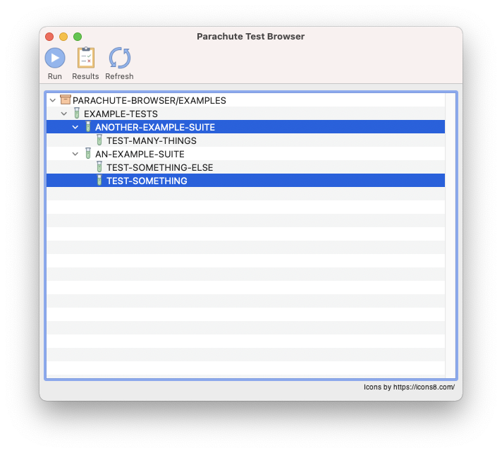
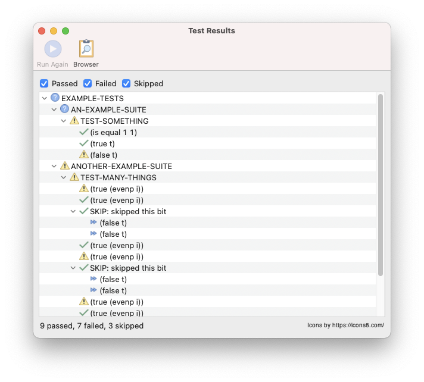
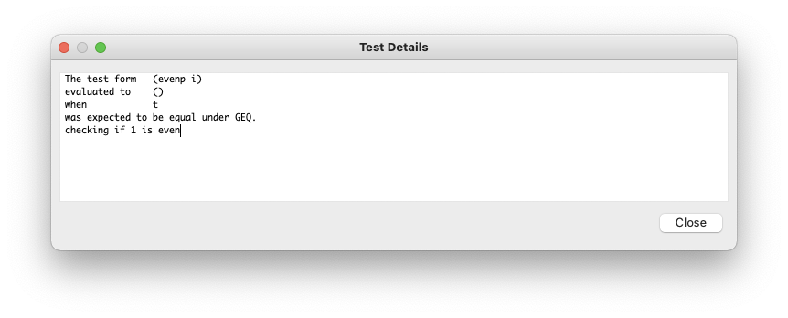

# Parachute Browser for LispWorks

A lightweight browser & test runner for using the Parachute test framework in LispWorks. Made
available in the hope it will be useful to someone, somewhere, someday.

## License

### The MIT License

> Copyright (c) 2021 Julian Baldwin.
>
> Permission is hereby granted, free of charge, to any person obtaining a copy of this software and
> associated documentation files (the "Software"), to deal in the Software without restriction,
> including without limitation the rights to use, copy, modify, merge, publish, distribute,
> sublicense, and/or sell copies of the Software, and to permit persons to whom the Software is
> furnished to do so, subject to the following conditions:
>
> The above copyright notice and this permission notice shall be included in all copies or
> substantial portions of the Software.
>
> THE SOFTWARE IS PROVIDED "AS IS", WITHOUT WARRANTY OF ANY KIND, EXPRESS OR IMPLIED, INCLUDING BUT
> NOT LIMITED TO THE WARRANTIES OF MERCHANTABILITY, FITNESS FOR A PARTICULAR PURPOSE AND
> NONINFRINGEMENT. IN NO EVENT SHALL THE AUTHORS OR COPYRIGHT HOLDERS BE LIABLE FOR ANY CLAIM,
> DAMAGES OR OTHER LIABILITY, WHETHER IN AN ACTION OF CONTRACT, TORT OR OTHERWISE, ARISING FROM, OUT
> OF OR IN CONNECTION WITH THE SOFTWARE OR THE USE OR OTHER DEALINGS IN THE SOFTWARE.

### Acknowledgements

Parachute Browser uses freely-available **[Icons8](https://icons8.com/)** icons for the user
interface.

## Requirements

- LispWorks (developed on LW 7.1.3 Mac)
- **[Alexandria](https://common-lisp.net/project/alexandria/)**
- **[Parachute](https://github.com/Shinmera/parachute)**

## Getting Started

    ;; ensure Alexandria and Parachute loaded however makes sense for your use case.
    ;; define your tests in whatever manner you see fit - see example-tests.lisp
    CL-USER 1 > (load "defsys.lisp")
    CL-USER 2 > (compile-system "parachute-browser" :load t)
    CL-USER 3 > (parachute-browser:browse-tests)

## Features

### Test Browser

The test browser shows the hierarchy of packages and the tests they contain. You may run an
arbitrary combination of tests by selecting them and clicking `Run` in the toolbar. To run a single
item (and all nested items) simply double click it. Click `Refresh` to refresh the list of tests in
the browser after defining new ones in your code. Click `Results` to go to the results viewer if
this is open.

### Result Viewer

The result viewer shows results from the most recent test run. A green checkmark indicates the test
passed, a warning sign indicates failure, and a fast forward icon indicates the test was skipped.
Where full information is not available (e.g. only a subset of the tests were executed) the icon
will be a question mark. You may re-run a test by selecting it and clicking `Run Again` in the
toolbar. Click `Browser` to return to the test browser. The check boxes above the result tree allow
filtering results based on status. Items with unknown status are always visible.

To get detailed information about a test result, double-click it:

#### Caveats

- Clicking `Run Again` will run all tests under the selected item and does not currently consider
  the filter selection in the viewer.
- Clicking `Run Again` without a selected item will re-run all tests from the root of the result
  tree (including children).

### Background Execution & Listener

Tests are executed in a background worker thread. This enables a better experience on Cocoa by not
running them in the event loop which is difficult to debug. Execute tests at the REPL via the
`execute-tests-in-background` function:

    CL-USER 4 > (parachute-browser:execute-tests-in-background (find-package '#:parachute-browser/examples))

which takes a Parachute test designator (or list of designators) and a `:result-process` keyword
argument specifying where to send the results. This defaults to `(mp:get-current-process)` on all
platforms except Cocoa, where it is `mp:*main-process*` (the Cocoa event loop). The result process
needs to be handling events using LispWorks' standard `mp:general-handle-event` methodology to
display the result viewer.

## Bugs, Optimisations & Todo

Probably innumerable.

It may be nice to hook into Parachute's test definition process to automatically update the browser
as tests are defined and redefined.
