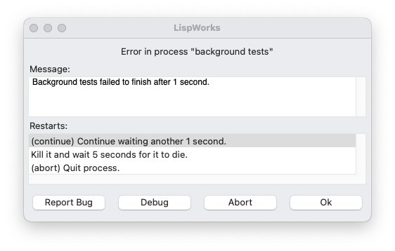

# Parachute Browser for LispWorks

A lightweight browser & test runner for using the Parachute test framework in LispWorks. Made
available in the hope it will be useful to someone, somewhere, someday.

## License

### The MIT License

> Copyright (c) 2021 Julian Baldwin.
>
> Permission is hereby granted, free of charge, to any person obtaining a copy of this software and
> associated documentation files (the "Software"), to deal in the Software without restriction,
> including without limitation the rights to use, copy, modify, merge, publish, distribute,
> sublicense, and/or sell copies of the Software, and to permit persons to whom the Software is
> furnished to do so, subject to the following conditions:
>
> The above copyright notice and this permission notice shall be included in all copies or
> substantial portions of the Software.
>
> THE SOFTWARE IS PROVIDED "AS IS", WITHOUT WARRANTY OF ANY KIND, EXPRESS OR IMPLIED, INCLUDING BUT
> NOT LIMITED TO THE WARRANTIES OF MERCHANTABILITY, FITNESS FOR A PARTICULAR PURPOSE AND
> NONINFRINGEMENT. IN NO EVENT SHALL THE AUTHORS OR COPYRIGHT HOLDERS BE LIABLE FOR ANY CLAIM,
> DAMAGES OR OTHER LIABILITY, WHETHER IN AN ACTION OF CONTRACT, TORT OR OTHERWISE, ARISING FROM, OUT
> OF OR IN CONNECTION WITH THE SOFTWARE OR THE USE OR OTHER DEALINGS IN THE SOFTWARE.

### Acknowledgements

Parachute Browser uses freely-available **[Icons8](https://icons8.com/)** icons for the user
interface.

## Requirements

- LispWorks (tested on LW 8.0.1 Mac and LW 7.1.3 Mac)
- **[Alexandria](https://common-lisp.net/project/alexandria/)**
- **[Parachute](https://github.com/Shinmera/parachute)**

## Getting Started

Parachute Browser is available from **[Ultralisp](https://ultralisp.org/dists/lispworks)** in the
`lispworks` distribution:

    CL-USER 1> (ql:quickload "parachute-browser")

Or for a local installation, assuming ASDF knows where to find it:

    ;; define your tests in whatever manner you see fit - see example-tests.lisp
    CL-USER 1 > (asdf:load-system "parachute-browser")
    CL-USER 2 > (parachute-browser:browse-tests)

A set of example tests (with intentional failures) is available in the file `example-tests.lisp`:

    CL-USER 1> (parachute-browser:load-examples)

## Features

### NEW: Background Timeout

Failure of background tests to complete within a timeout is now reported in the LispWorks IDE. This
is controlled by the `PARACHUTE-BROWSER:*BACKGROUND-TIMEOUT*` special, which is the number of
seconds to wait for tests to finish. If the tests have not completed when the timeout elapses a
monitor process will signal an error with some useful restarts that allow you to kill the test
process or continue waiting.

I've implemented this more to provide a notification that a test has failed to terminate.
Occasionally a test can end up stuck in an infinite loop that never runs out of stack due to TCO,
deadlocked, waiting for a network request, etc. This feature alerts you to the fact your tests
haven't finished. The default timeout is 60 seconds; this behaviour can be disabled by setting it
to `NIL`.

### LESS NEW: Debug Tests

You can now run one or more tests interactively where failures enter the debugger rather than fail
the test outright. This works similarly to the Run/Run Again buttons: select one or more tests
and click the Debug button in the toolbar to run them using the `PARACHUTE:INTERACTIVE` report,
which allows errors to bubble up and invoke the debugger. Tests are still executed in a background
process, so entering the debugger will not block the user interface.

### Automatic Refresh & Execute

You can now automatically refresh the test browser when defining a test using the
`PARACHUTE-BROWSER:DEFINE-TEST` macro. To see this, set `PARACHUTE-BROWSER:*AUTOMATIC-REFRESH*` to a
true value and use the editor command `Compile Defun` to compile and evaluate a test. If you have a
test browser interface open it will be refreshed automatically.

Tests defined with `PARACHUTE-BROWSER:DEFINE-TEST` can now be automatically executed when defined.
To enable this, set `PARACHUTE-BROWSER:*AUTOMATIC-EXECUTE*` to a true value and evaluate a test
form. If you have an existing result viewer open, you will see it update with the results of the
test, although the interface won't receive focus (to avoid breaking your workflow by having to
switch back to the editor window to continue writing code). Automatic execute _only_ works with an
existing result viewer, so make sure there's one open if you don't see results. Running tests from
the test browser will always display and focus a result viewer.

These features are really designed for interactive development in the LispWorks IDE rather than
running a full test suite. A helper function `PARACHUTE-BROWSER:TOGGLE-AUTOMATIC-BEHAVIOUR` is
available to quickly turn them on or off as needed.

### Source Navigation

Define your tests using `PARACHUTE-BROWSER:DEFINE-TEST` which is a thin wrapper over Parachute's
underlying `DEFINE-TEST`. This leverages LispWorks' underlying Dspec infrastructure to record the
source location of test definitions. You may then navigate to a test by selecting it in either the
browser or result viewer and clicking the `Source` button in the toolbar. You may also navigate to
the test by using the alternate action for your platform (on Mac, this is holding down the Command
key while double-clicking the list item). You can also navigate to the package definition from the
test browser interface.

Caveats: `PARACHUTE-BROWSER:DEFINE-TEST` is the only definer currently implemented. Source
navigation to individual assertions or tests defined with Parachute's native `DEFINE-TEST` is not
currently possible without modifying Parachute itself.

### Test Browser

The test browser shows the hierarchy of packages and the tests they contain. You may run an
arbitrary combination of tests by selecting them and clicking `Run` in the toolbar. To run a single
item (and all nested items) simply double click it. Click `Refresh` to refresh the list of tests in
the browser after defining new ones in your code. Click `Results` to go to the results viewer if
this is open.

### Result Viewer

The result viewer shows results from the most recent test run. A green checkmark indicates the test
passed, a warning sign indicates failure, and a fast forward icon indicates the test was skipped.
Where full information is not available (e.g. only a subset of the tests were executed) the icon
will be a question mark. You may re-run a test by selecting it and clicking `Run Again` in the
toolbar. Click `Browser` to return to the test browser. The check boxes above the result tree allow
filtering results based on status. Items with unknown status are always visible.

To get detailed information about a test result, double-click it:

#### Caveats

- Clicking `Run Again` will run all tests under the selected item and does not currently consider
  the filter selection in the viewer.
- Clicking `Run Again` without a selected item will re-run all tests from the root of the result
  tree (including children).

### Background Execution & Listener

Tests are executed in a background worker thread. This enables a better experience on Cocoa by not
running them in the event loop which is difficult to debug. Execute tests at the REPL via the
`execute-tests-in-background` function:

    CL-USER 4 > (parachute-browser:execute-tests-in-background (find-package '#:parachute-browser/examples))

which takes a Parachute test designator (or list of designators) and a `:result-process` keyword
argument specifying where to send the results. This defaults to `(mp:get-current-process)` on all
platforms except Cocoa, where it is `mp:*main-process*` (the Cocoa event loop). The result process
needs to be handling events using LispWorks' standard `mp:general-handle-event` methodology to
display the result viewer.

## Bugs, Optimisations & Todo

Probably innumerable.

Supporting multiple testing frameworks might be useful, although Parachute is pretty deeply
ingrained in the codebase. Realistically this would probably require a rewrite to get the underlying
architecture sorted out.
